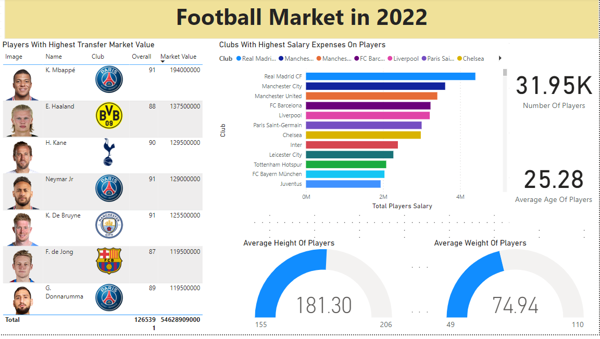
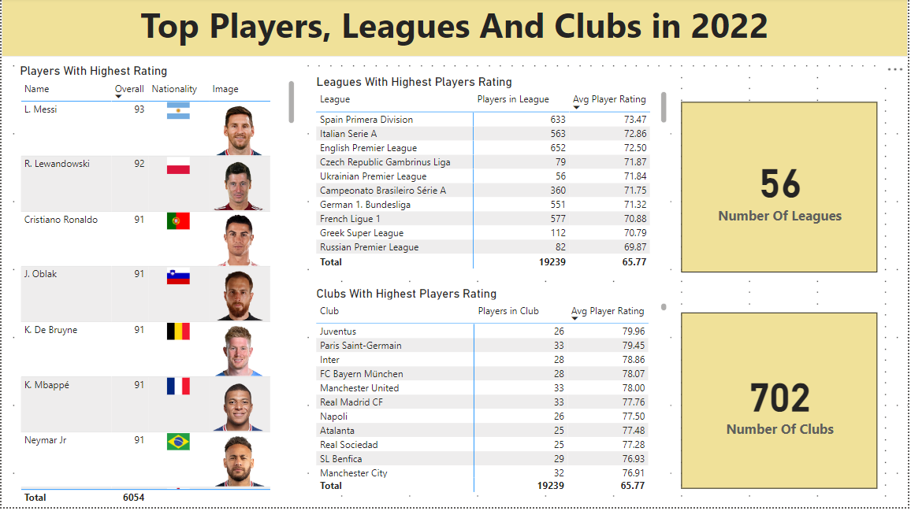
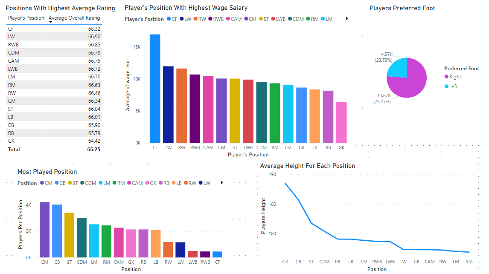
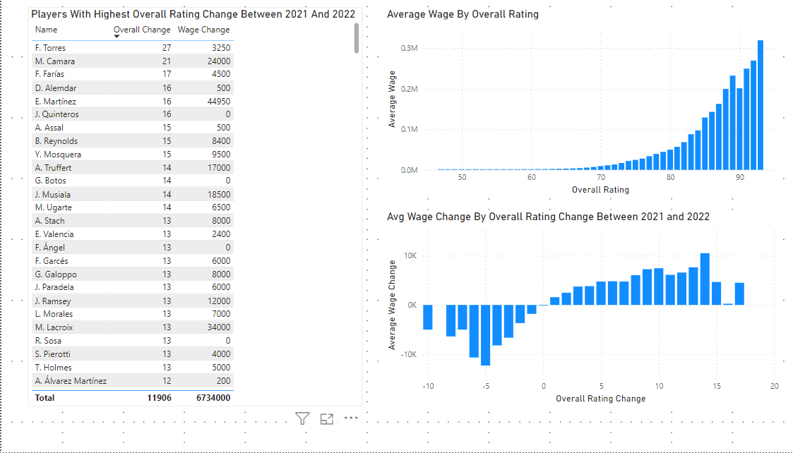
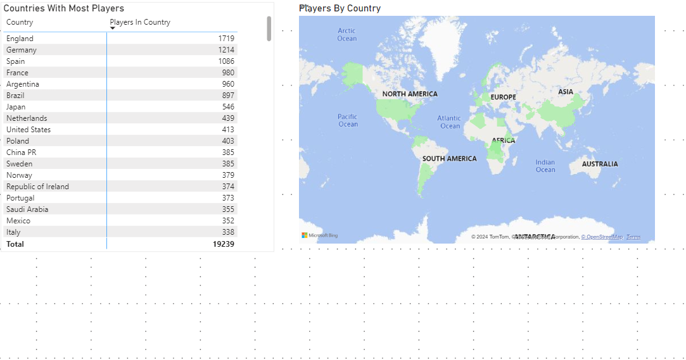

# Football Market Analysis Project

## Overview
The Football Market Analysis Project is a comprehensive analysis of football player data spanning the years 2021 to 2022. The project focuses on analyzing various player attributes such as ratings, transfer market values, salaries, leagues, clubs, ages, and positions using Power BI.

## Key Features
1. **Data Collection and Preparation:**
   - Gathered and prepared data on 30,000 football players from multiple sources for analysis.

2. **Exploratory Data Analysis (EDA):**
   - Conducted in-depth exploratory data analysis to uncover trends, patterns, and insights in player data.

3. **Visualization Development:**
   - Developed interactive visualization to effectively represent  player characteristics, including ratings, transfer values, and  clubs with highest salaries expenses on players.
     

4. **Comparative Analysis:**
   - Compared player attributes and performance metrics across different football leagues to assess league competitiveness, talent distribution, and market dynamics.
          
   - Examined player performance and characteristics based on their positions, uncovering insights into positional strengths, weaknesses, and market demands.
          
     
5. **Time-Series Analysis:**
   - Analyzed player data over time to understand identify rising stars, changes in ratings and salaries across different seasons.
          
     
5. **Country Analysis:**
   - Identified countries with the most football players to understand global distribution and hotspots of talent.
          
     
## Data Derived from Excel

The data used in this project was extracted from an Excel file [here](https://raw.githubusercontent.com/AlexTheAnalyst/Power-BI/main/Power%20BI%20-%20Final%20Project.xlsx).

